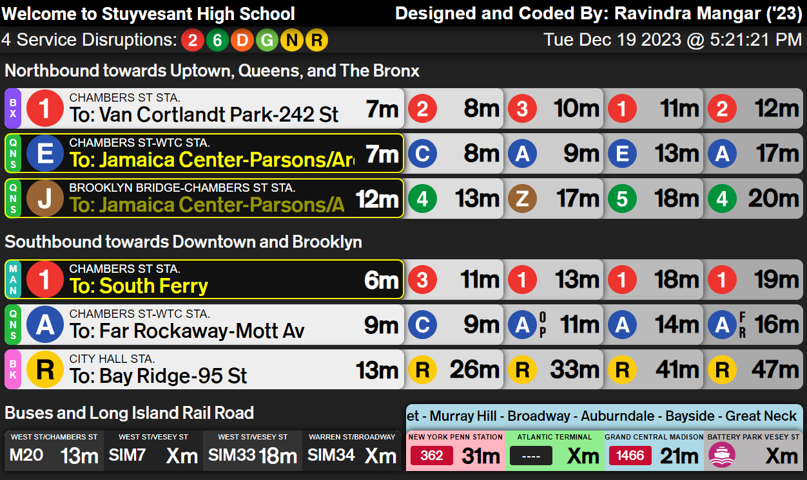

# Personal Project: STUA Countdown Board
Designed and Coded By: <b>Ravindra Mangar</b>
 
Last Updated: <b>December 19th, 2023</b>

---

In 2020, I was appointed to be the next leader of the Stuyvesant Transit and Urbanism Association (STUA). The previous leaders had been working with the MTA Google API for years, but were unable to figure out how to create a functioning departure board for the school. 
 

In September of 2022, the very first versions of the STUA Countdown Board were displayed, featuring data from the surrounding downtown subway lines, as well as the LIRR. First being coded using PyGame hosted on a local schol computer, this is the most up to date version of the project.

The current version of the board is a web app coded using HTML/CSS/JS, being ran on a Nginx server hosted on Digital Ocean. The link to it is here: http://206.189.183.69:8082/. This repository contains the complete code from the project:

- MTA and BusTime keys can be found from MTA Developer Resources at https://api.mta.info/#/landing by creating an account. NYC Ferry does not require an API key.
- Updated `gtfs_realtime_pb2.py` and `nyct_subway_pb2.py` may be required. To do so, download the protoc installer at https://github.com/protocolbuffers/protobuf and follow the instructions.
- `gtfs-realtime.proto` is located at https://developers.google.com/transit/gtfs-realtime/gtfs-realtime-proto, `nyct-subway.proto` is in the MTA Developer Portal.

To run the project, enter the MTA and BusTime API keys into `export.py`. Then, run `python3 main_web.py`, `python3 main_api.py`, and `python3 main_proc.py` simultaneously in different threads. After running the above programs, the API for the project can be found at http://127.0.0.1:7082/. The web app can be found at http://127.0.0.1:8082/.
- To access the API for subway/bus/ferry data: http://127.0.0.1:7082/data
- To access the API for lirr data: http://127.0.0.1:7082/lirr
- To access the API for delay data: http://127.0.0.1:7082/delay

Some pictures of the current version of the project, are below:

## Current Version (September 2023 - TBD):

